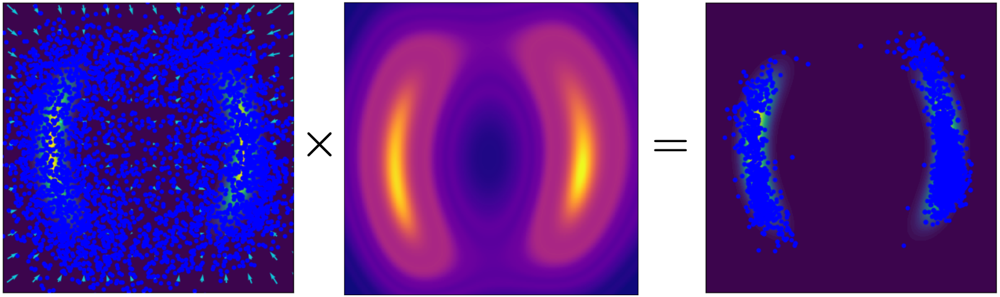

## Score-Based Density Estimation from Pairwise Comparisons<br><sub>Official PyTorch implementation of the ICLR 2026 paper</sub>



**Score-Based Density Estimation from Pairwise Comparisons**<br>
Petrus Mikkola, Luigi Acerbi, Arto Klami
<br>https://arxiv.org/abs/2510.09146<br>

Abstract: *We study density estimation from pairwise comparisons, motivated by expert knowledge elicitation and learning from human feedback. We relate the unobserved target density to a tempered winner density (marginal density of preferred choices), learning the winner's score via score-matching. This allows estimating the target by `de-tempering' the estimated winner density's score. We prove that the score vectors of the belief and the winner density are collinear, linked by a position-dependent tempering field. We give analytical formulas for this field and propose an estimator for it under the Bradley--Terry model. Using a diffusion model trained on tempered samples generated via score-scaled annealed Langevin dynamics, we can learn complex multivariate belief densities of simulated experts, from only hundreds to thousands of pairwise comparisons.*

## Requirements

Install dependencies:
```
pip install -r requirements.txt
```

## License and Attribution

This project is authored by Petrus Mikkola ([petrus-mikkola](https://github.com/petrus-mikkola)). 

As this work incorporates and adapts code from projects licensed under **CC BY-NC-SA 4.0**, this entire repository is distributed under the same terms to comply with the "ShareAlike" requirement.

This repository is licensed under the **[Creative Commons Attribution-NonCommercial-ShareAlike 4.0 International License](http://creativecommons.org/licenses/by-nc-sa/4.0/)**.

This project builds upon and modifies code from the following sources:

1. **NVIDIA CORPORATION & AFFILIATES** &copy; 2024
   * **Source:** [edm2](https://github.com/NVlabs/edm2)
   * **License:** [CC BY-NC-SA 4.0](http://creativecommons.org/licenses/by-nc-sa/4.0/)
   * **Contribution:** Modified logic from `generate_images.py` and `toy_example.py`. Included `phema.py`.

2. **Google Research Authors** &copy; 2020
   * **Source:** [score_sde_pytorch](https://github.com/yang-song/score_sde_pytorch)
   * **License:** [Apache License, Version 2.0](http://www.apache.org/licenses/LICENSE-2.0)
   * **Contribution:** Modified logic from `likelihood.py`.


## Citation
Accepted to ICLR 2026, the citation will be updated soon..
```
@inproceedings{mikkola2026scorepair,
 author = {Mikkola, Petrus and Acerbi, Luigi and Klami, Arto},
 booktitle = {The Fourteenth International Conference on Learning Representations},
 title = {Preferential Normalizing Flows},
 year = {2026}
}
```
